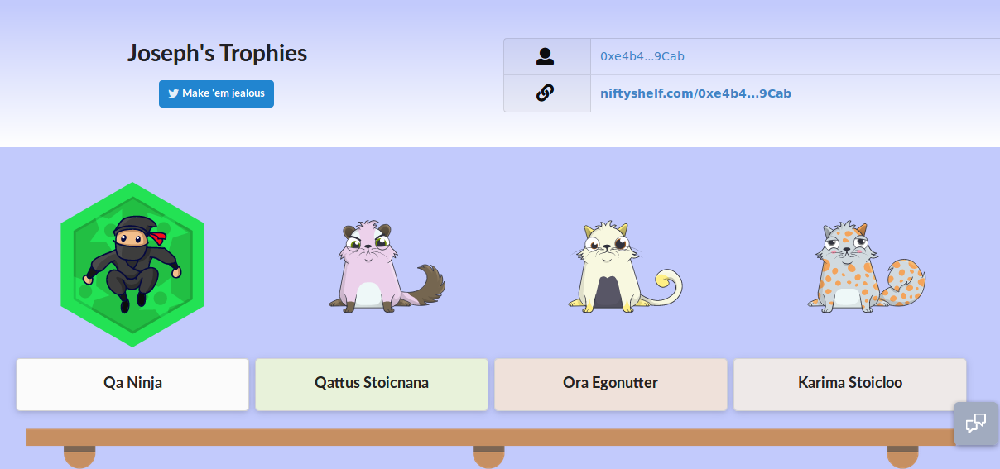

<h1 align="center">Nifty Shelf</h1>

<b> Your NFT Tokens... on a shelf.</b>

<h3 align="center"> Live at https://niftyshelf.com
</h3>

## Features Completed

:white_check_mark: Display NFT trophies on a shelf.

## Features Planned

- TBD

## Run it locally

1.  Run `npm install` in both root directory, and in `/client`
2.  Create `config.js` in `./db/` and enter your mongoDB URL
    > process.env.MONGODB_URI = "mongodb://..."
3.  cd to root directory and run `npm start`

## Contributions welcome!

This tool is primarily maintained by a single person. It is self-funded and free to use.

Please consider helping by submitting an issue or PR.

## Check out my other free blockchain resources

- [One Click dApp](https://github.com/blockchainbuddha/one-click-dapp)- Instantly build a dApp with a simple URL to bookmark or share with a friend.
- [Walrus Paper Wallet Generator](https://github.com/blockchainbuddha/Walrus-Paper-Wallet-Generator)- Print hundreds of paper wallets quickly.
- [Smart Contract Troubleshooter](https://github.com/blockchainbuddha/Solidity-Troubleshooting-Guide)- A quick sanity check for Solidity.
- [Patrick's blockchain resources](https://github.com/blockchainbuddha/Intro-to-Blockchain)- If I taught it, you can find it here.

## Contact

[Patrick](https://twitter.com/pi0neerpat),
[Joseph](https://twitter.com/cupojoseph)
